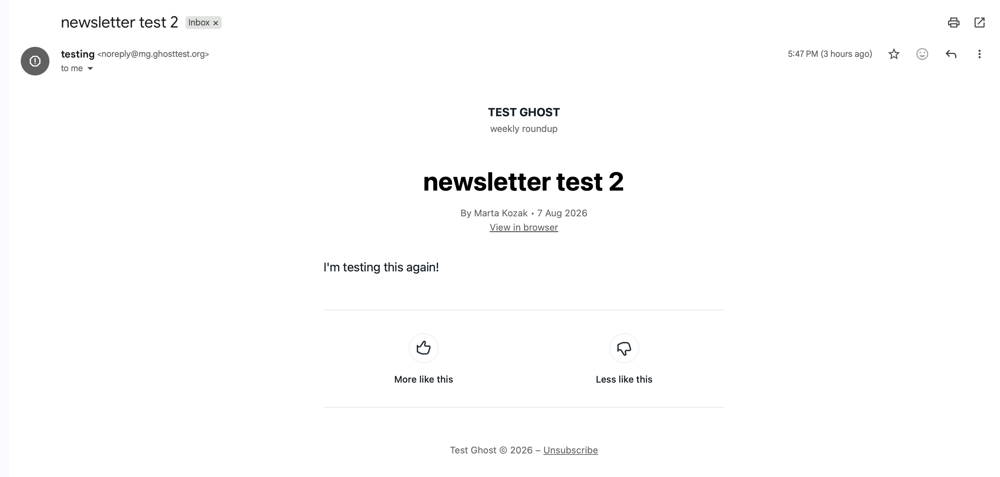
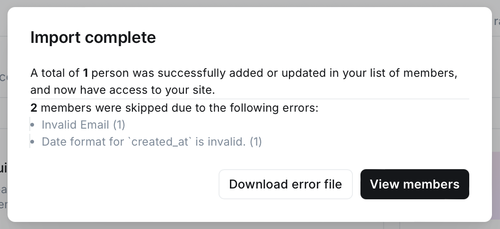

# Ghost: investigative work

I ran Ghost 6.56.0 with MySQL 8.0 in Docker and wrote my own 
`docker-local/docker-compose.yml` to get everything running locally.

I wanted to see what it feels like to troubleshoot Ghost, follow problems through the product,
inspect logs, and understand how a support engineer could investigate real customer issues.

## What stood out to me

- The **Impersonate** feature on member profiles. Ghost says to "use it
to sign into their account for customer support". I didn't expect a CMS 
to have a support tool this directly built into the product. It made me 
think about how much easier it is for support to reproduce and investigate 
a customer's experience when the product itself provides the right tools.

- The **Member activity** and **History log**. It logs every action
automatically: who signed up, when, what they did. You don't need to guess,
and there is no need to install an additional activity-log plugin like you'd
expect on most CMS platforms.

- The **post editor's card system** also impressed me. There are a lot of different cards
for image, gallery, video, file, callout, and so on. Coming from WordPress, where 
getting this level of content usually means installing separate plugins from different 
developers. I liked how much of the publishing experience is built into Ghost itself.

## Hands-on Ghost exploration

## Newsletter investigation

I wanted to investigate the newsletter flow because email deliverability is an important part of Ghost.

1. **Invalid sender domain.** 
   I initially configured the sender as: `noreply@localhost`
   Mailgun rejected it because `localhost` isn't a real, deliverable domain.
   I switched to the Mailgun sandbox domain and continued the investigation.

2. **The fix didn't apply.** 
   I then changed `mail.from` in the Docker environment configuration and restarted the container, 
   expecting the newsletter to use the new address. 

   It didn't.

   After investigating the settings, I found that each newsletter has its own sender-email field under:
   `Settings → Newsletters → [newsletter name]`
    So I updated the sender address there.

3. **Moved to a real, verified domain.** 
   
   Sandbox domains have restrictions, so I added a subdomain to
   Mailgun, added the generated `SPF/DKIM/DMARC` records to DNS, 
   then pointed both Mailgun and the newsletter's
   sender field at it. Email arrived successfully.

## CSV member import investigation

I wanted to see how Ghost handles bad input and what information it gives back to a user or support engineer.

I uploaded a CSV from `csv-impport-test/members-bad.csv` with two broken rows (invalid email format,
invalid date format) alongside one valid row.

Result: "1 person was successfully added... 2 members were skipped due
to the following errors: Invalid Email (1), Date format for
`created_at` is invalid. (1)"

Additionally, Ghost generated a downloadable error CSV (`csv-import-test/Import 2026-08-07 16_04 - Errors.csv`) 
with the exact error attached to each failed row. I liked this because the error reporting is actionable. 
It doesn't just say that the import failed and it tells you which rows need attention and what needs to be fixed.

## Stripe investigation

I triggered a Stripe connection attempt in my local environment 
and then investigated the failure through the container logs.

The log showed:

    Cannot connect to stripe unless site is using https://

The message pointed me towards `stripe-connect.js`.

I opened the file directly inside the container and found the relevant check:

    function checkCanConnect() {
        const productionMode = config.get('env') === 'production';
        const siteUrlUsingSSL = /^https/.test(siteUrl);
        const cannotConnectToStripe = productionMode && !siteUrlUsingSSL;
        ...
    }

This made the behaviour much clearer.

The restriction only applies when:
1. NODE_ENV is production
2. the configured site URL does not use HTTPS

Both conditions have to be true.

## Admin API investigation. 

I also wanted to understand how Ghost could be automated from a support or operations perspective.
I created a post programmatically using a custom integration's Admin API key and JWT authentication.
I wrote a small Python script: `scripts/create_post.py`
The script successfully created a post, and I confirmed that it appeared in Ghost Admin as a draft.

This gave me a practical look at how Ghost's API could be used to automate repetitive support 
or operational tasks instead of handling everything manually through the UI.
